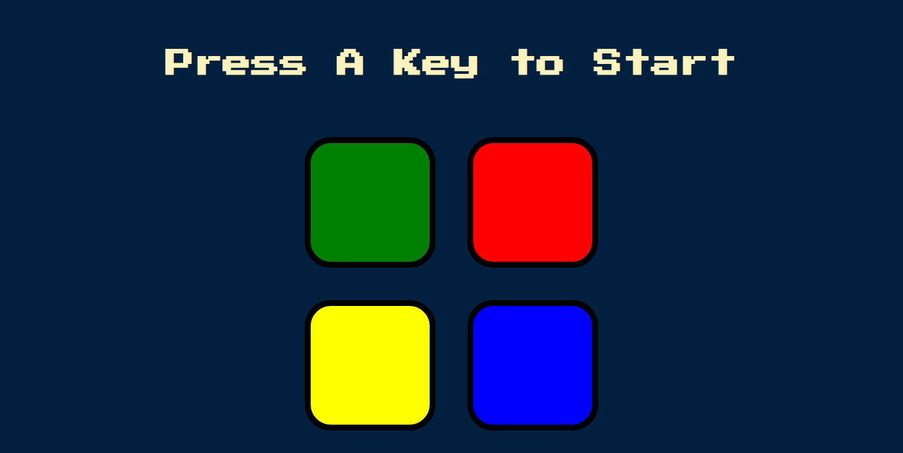

# simon-game
Simon game is like a memory game 
TO start game press A key 
rules to play this game
when you start game it pops a sound with highlighting the color you have to press the same key when it stops
and you increase to level 2 you have to memorize the first color and color popped up after reaching level 2 then you have to press first and second color 
like that you reach to next levels

